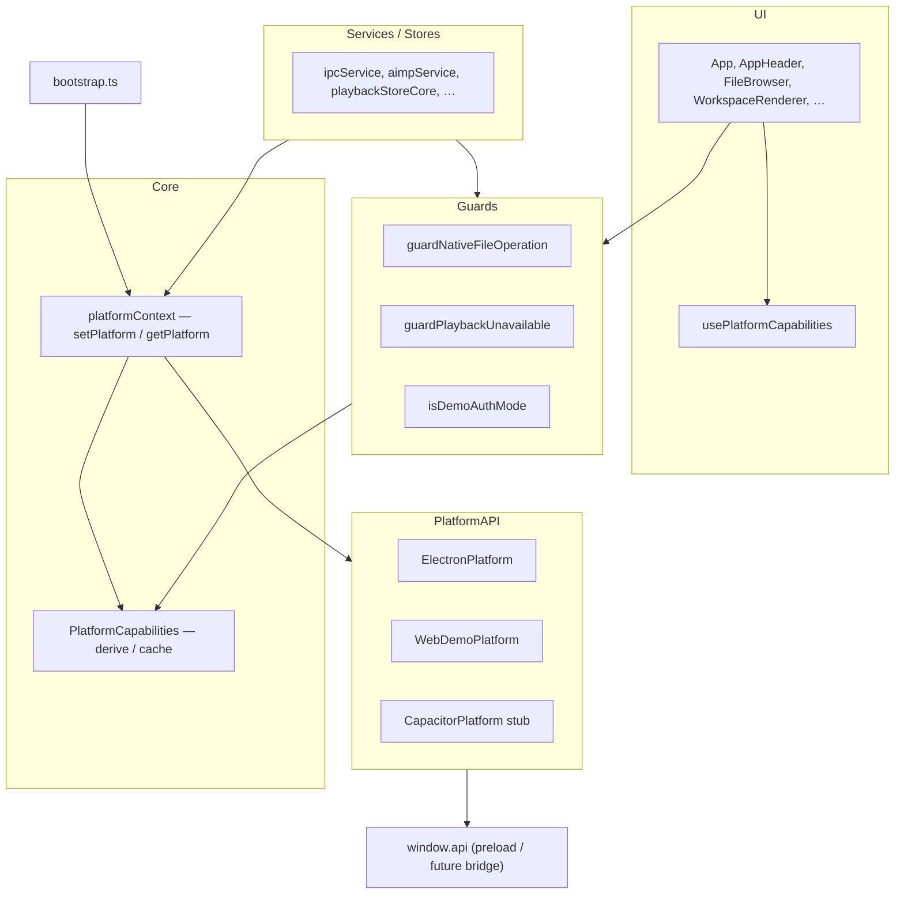

# Platform layer

Слой платформы CherryPlayList: выбор runtime при старте, единый `PlatformAPI`, capability-флаги для gating в UI/stores/services. Подготовка к Capacitor/Android без разветвлений `getAppMode() === 'demo'` по коду.

См. также: [веб-демо](../../web-demo.md), [Android/Capacitor brief](../../android-capacitor-brief.md), [IPC Service](../services/ipc-service.md), [Playback Engine — слои](../audio/playback-layers.md).

---

## Слои



Параллельный стек воспроизведения (без изменений в platform-refactor): `playbackStoreCore` → `PlaybackEngine` → `PlatformAudioAdapter` → IPC. Gating playback — через `supportsLocalFilePlayback` / `guardPlaybackUnavailable`.

---

## Bootstrap

Порядок в `src/bootstrap.ts`:

1. `VITE_APP_MODE=demo` → сброс demo persist → `WebDemoPlatform`, mode `demo`
2. `VITE_APP_MODE=capacitor` → `CapacitorPlatform`, mode `capacitor`
3. `window.api` есть → `ElectronPlatform`, mode `electron`
4. иначе → ошибка с подсказкой `dev` / `dev:web` / `dev:capacitor`

`setPlatform(impl, mode)` обновляет singleton `PlatformAPI` и кэш capabilities (`refreshPlatformCapabilities`).

| Скрипт                  | Runtime                                          |
| ----------------------- | ------------------------------------------------ |
| `npm run dev`           | Electron                                         |
| `npm run dev:web`       | Web demo fixtures (`demo`, без `VITE_DEMO_LIVE`) |
| `npm run dev:web:live`  | Web demo live (`demo` + `VITE_DEMO_LIVE=1`)      |
| `npm run dev:capacitor` | Capacitor stub (`capacitor`), без Electron       |

В **web demo** URL CherryPlayServer по умолчанию — **пустая строка** (`demoConfig.ts`): REST и SignalR идут на same-origin (`/api`, `/partyHub`) и проксируются Vite на `:5000`. Это актуально для **live** (`dev:web:live`); fixtures не зависят от сервера. См. [веб-демо](../../web-demo.md). **`VITE_API_URL`** — прямой base URL (без proxy, нужен CORS). Live-флаг: `isDemoLiveMode()` / `VITE_DEMO_LIVE=1` (не новый `AppMode`).

---

## Capability matrix

Значения из `derivePlatformCapabilities()` (`src/shared/platform/platformCapabilities.ts`). **Источник истины — код**; таблица для обзора.

| Capability                     | electron | demo (fixtures) |  demo (live)  | capacitor (stub) |
| ------------------------------ | :------: | :-------------: | :-----------: | :--------------: |
| `supportsLocalFilePlayback`    |    ✓     |        ✗        |       ✗       |        ✗         |
| `supportsNativeFileSystem`     |    ✓     |        ✗        |       ✗       |        ✗         |
| `supportsProjectPersistence`   |    ✓     |        ✗        |       ✗       |        ✗         |
| `supportsAimpWorkspace`        |    ✓     |  ✓ (simulated)  | ✓ (simulated) |        ✗         |
| `supportsAudioDeviceSelection` |    ✓     |        ✗        |       ✗       |        ✗         |
| `supportsLoudnessAnalysis`     |    ✓     |  ✓ (simulated)  | ✓ (simulated) |        ✗         |
| `supportsRealAuth`             |    ✓     |        ✗        |       ✓       |        ✗         |
| `simulatesExport`              |    ✗     |        ✓        |       ✓       |        ✗         |
| `usesFixtureFileBrowser`       |    ✗     |        ✓        |       ✓       |        ✗         |

В mode `demo` флаг `supportsRealAuth` берётся из `isDemoLiveMode()` (`VITE_DEMO_LIVE=1`). Остальные demo-capabilities одинаковы для fixtures и live.

**AIMP** — в Electron: реальный named-pipe bridge; в **web demo** (fixtures и live): `supportsAimpWorkspace === true` с симулированным `WebDemoPlatform.aimp` (фикстурный плейлист/playback, без AIMP.exe). Capacitor stub: `false`.

**Loudness** — в Electron: FFmpeg ebur128; в **web demo**: `supportsLoudnessAnalysis === true` с детерминированными фикстурами (`demoLoudnessAnalyzer`, IPC `audio:analyzeLoudness` / `audio:statAudioFile`), без FFmpeg. Capacitor stub: `false`.

**Capacitor stub:** все capability-флаги `false` (как у неготовых фич), guards показывают «Недоступно на этой платформе». После Etap 0–5 [Android brief](../../android-capacitor-brief.md) флаги включаются по мере появления плагинов — матрицу обновлять вместе с `derivePlatformCapabilities`.

`CapacitorPlatform` (`src/shared/platform/capacitorPlatform.ts`): без `@capacitor/*`; при наличии `window.api` делегирует IPC, иначе — controlled `demoUnavailableResponse`; AIMP API всегда заглушка.

---

## Правило для контрибьюторов

| Задача                                                                | Использовать                                                       |
| --------------------------------------------------------------------- | ------------------------------------------------------------------ |
| Можно ли воспроизводить файлы, сохранять проект, AIMP, auth, export   | `getPlatformCapabilities()` или guards                             |
| Fixtures vs live web demo                                             | `isDemoFixturesMode()` / `isDemoLiveMode()` или `supportsRealAuth` |
| React-компонент                                                       | `usePlatformCapabilities()` (тонкая обёртка над singleton)         |
| Идентичность runtime, логи, косметика демо (баннер, `document.title`) | `getAppMode()` (+ live-флаг для текста баннера)                    |

**Не** писать `getAppMode() === 'demo'` для feature gating — только capabilities, live helpers или guards.

Прямой доступ к `window.api` — только в `ElectronPlatform` и `CapacitorPlatform`.

---

## Public API (`@shared/platform`)

| Экспорт                                                                                     | Назначение                                                             |
| ------------------------------------------------------------------------------------------- | ---------------------------------------------------------------------- |
| `setPlatform`, `getPlatform`, `getPlatformAppMode`, `isPlatformInitialized`                 | Контекст и активная реализация                                         |
| `getPlatformCapabilities`, `derivePlatformCapabilities`, `refreshPlatformCapabilities`      | Capability singleton                                                   |
| `usePlatformCapabilities`                                                                   | Hook для UI                                                            |
| `getAppMode`, `isNativePlatformAvailable`                                                   | Identity; AIMP alias → `supportsAimpWorkspace` (deprecated для gating) |
| `isDemoLiveMode`, `isDemoFixturesMode`                                                      | Live overlay (`VITE_DEMO_LIVE`) vs fixtures в mode `demo`              |
| `ElectronPlatform`, `WebDemoPlatform`, `CapacitorPlatform`                                  | Реализации `PlatformAPI`                                               |
| `getPlatformUnavailableMessage`, `DEMO_UNAVAILABLE_MESSAGE`, `PLATFORM_UNAVAILABLE_MESSAGE` | Тексты blocked-feature toast (`warning`, не `info`)                    |
| `demoUnavailableResponse`, `throwDemoUnavailable`                                           | Ответы IPC / ошибки в demo/stub                                        |

Типы: `AppMode` (`'electron' \| 'demo' \| 'capacitor'`), `PlatformCapabilities`, `PlatformAPI`, `InvokeChannel`, …

---

## Guards (`src/shared/demo/`)

Тонкие обёртки над capabilities + стандартный toast (`notifyDemoUnavailable` → `addNotification({ type: 'warning', message: getPlatformUnavailableMessage() })`). Blocked-feature сообщения — **`warning`**, не `info` / `success`.

| Модуль                        | Функции                                                    | Capability                  |
| ----------------------------- | ---------------------------------------------------------- | --------------------------- |
| `guardNativeFileOperation.ts` | `isNativeFileOperationBlocked`, `guardNativeFileOperation` | `supportsNativeFileSystem`  |
| `guardPlayback.ts`            | `isLocalFilePlaybackBlocked`, `guardPlaybackUnavailable`   | `supportsLocalFilePlayback` |
| `guardDemoAuth.ts`            | `isDemoAuthMode`                                           | `supportsRealAuth`          |

В UI/stores предпочтительно вызывать guard перед операцией или читать capability для условного рендера (например скрыть AIMP workspace при `!supportsAimpWorkspace`).

---

## Связанные файлы

| Путь                                          | Роль                                      |
| --------------------------------------------- | ----------------------------------------- |
| `src/bootstrap.ts`                            | Выбор платформы                           |
| `src/shared/platform/platformCapabilities.ts` | Матрица capabilities                      |
| `src/shared/platform/demoLiveMode.ts`         | `isDemoLiveMode` / `isDemoFixturesMode`   |
| `src/shared/platform/fixtures/demoLoudnessAnalyzer.ts` | Demo simulated `audio:analyzeLoudness` / `audio:statAudioFile` |
| `src/shared/platform/platformContext.ts`      | Singleton platform + refresh capabilities |
| `src/shared/platform/capacitorPlatform.ts`    | Stub для Etap 0+                          |
| `src/shared/hooks/usePlatformCapabilities.ts` | React hook                                |
| `electron/preload.ts`                         | Канонический IPC-контракт (`window.api`)  |

---

## Проверка

```bash
cd CherryPlayList && npm run dev           # electron — FS, playback, AIMP
cd CherryPlayList && npm run dev:web       # fixtures — без сервера, supportsRealAuth=false
cd CherryPlayList && npm run dev:web:live  # live — нужен :5000, supportsRealAuth=true
cd CherryPlayList && npm run dev:capacitor # stub — boot без Electron, AIMP скрыт
```

В консоли после bootstrap: `getAppMode()`, `isDemoLiveMode()` и флаги `getPlatformCapabilities()` соответствуют выбранному скрипту.
