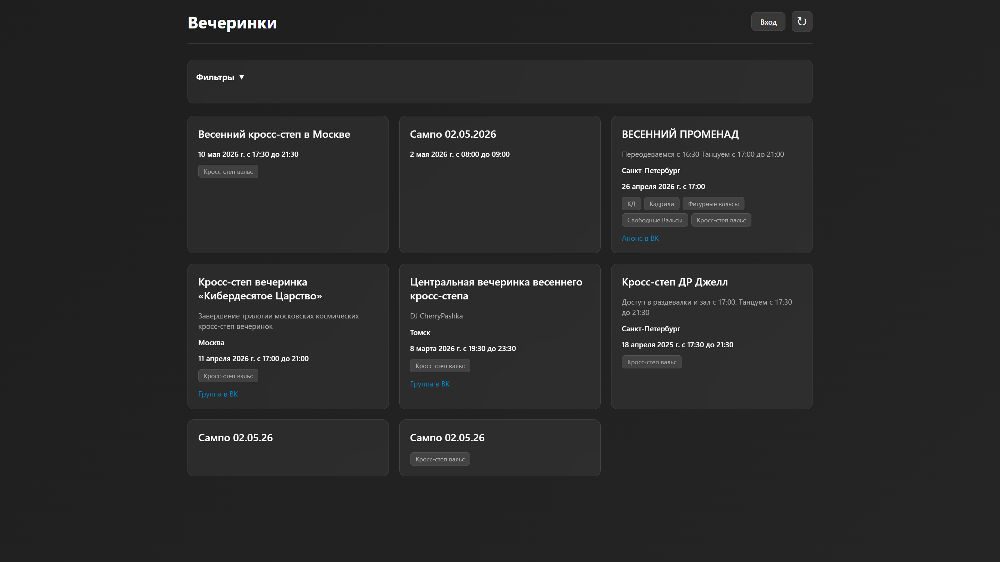
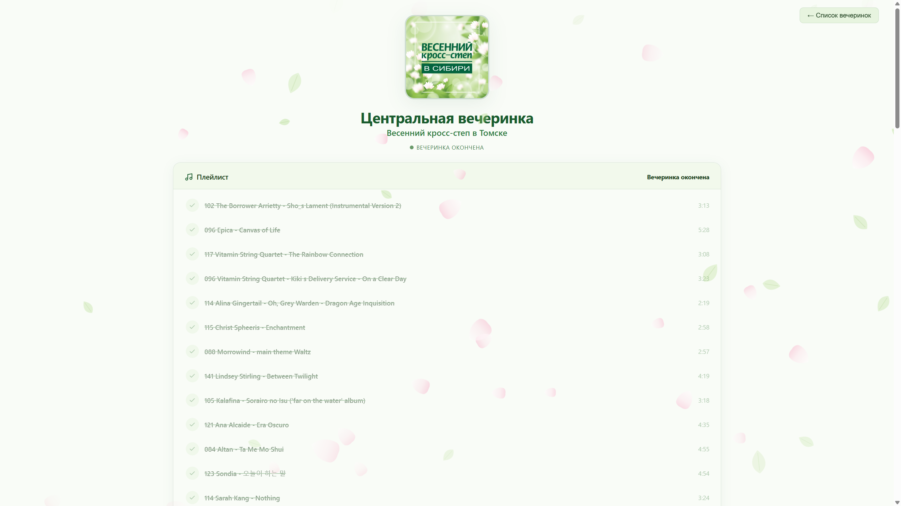
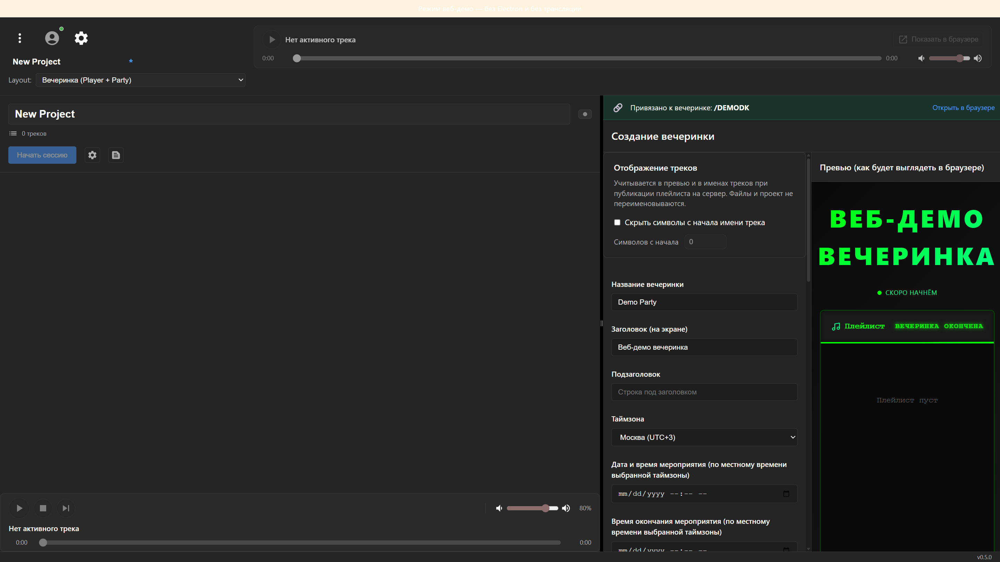

# CherryPlay

**Live:** [https://cherrypashkaparty.ru](https://cherrypashkaparty.ru) · **Repo:** [github.com/Urado/CherryPlay](https://github.com/Urado/CherryPlay)

CherryPlay — live-синхронизация плейлиста для офлайн-мероприятий. Организатор ведёт эфир из desktop-приложения; гости видят актуальный плейлист и «сейчас играет» в браузере. Ядро продукта — **realtime backend на .NET 9** (ASP.NET Core + SignalR + EF Core / PostgreSQL), уже в продакшене.

## Architecture flow

```text
Electron (organizer)  →  API + SignalR (.NET 9)  →  Web (guests)
```

Опционально: AIMP → named pipe → CherryPlayList → тот же SignalR/API → Web. Подробнее: [ARCHITECTURE.md](ARCHITECTURE.md), [docs/integration/aimp-streaming.md](docs/integration/aimp-streaming.md).

## Backend stack

- **ASP.NET Core** (.NET 9)
- **SignalR** (`/partyHub`) — live playback / playlist state
- **EF Core** + **PostgreSQL** (prod); optional in-memory repos for local/dev — see [ARCHITECTURE.md](ARCHITECTURE.md)
- **JWT / OAuth** (organizer auth; viewers are anonymous)
- **Docker** + **GitHub Actions** CI/CD — [.github/DEPLOYMENT.md](.github/DEPLOYMENT.md)

## 1-minute demo

1. Open **[https://cherrypashkaparty.ru](https://cherrypashkaparty.ru)** — public catalog / party pages (guests).
2. Pick a listed party (or open a known `party/<shortCode>` URL) — playlist + live session state via SignalR.
3. (Optional, local) Run organizer desktop: `cd CherryPlayList && npm run electron:dev` against a local or prod API — publish playlist / start session; watch Web update in real time.
4. Contracts and hub surface: [CONTRACTS.md](CONTRACTS.md).

## Screenshots

**Catalog (prod)**



**Party live (prod)**



**Organizer (CherryPlayList web mode)**



Capture notes: [docs/resume/README.md](docs/resume/README.md).

## Projects

- **CherryPlayServer** — Backend (.NET 9): REST + SignalR, EF/PostgreSQL, JWT/OAuth
- **CherryPlayList** — Desktop (Electron) for organizers; optional AIMP via named pipe
- **CherryPlayWeb** — Web app for guests (catalog + party pages)
- **CherryPlayComponents** — React playlist/theme components
- **CherryPlayAimpPlugin** — Native AIMP plugin (Windows x64): read-only NDJSON bridge `\\.\pipe\cherryplay-aimp-v1`

## Быстрый старт

### 🐳 Запуск с Docker (рекомендуется)

Docker Compose автоматически соберёт образы и запустит все сервисы:

```bash
# Запуск всех сервисов (автоматически соберет образы при первом запуске)
docker-compose up -d

# Просмотр логов
docker-compose logs -f

# Остановка всех сервисов
docker-compose down
```

После запуска будут доступны:

- **Frontend**: http://localhost:3000
- **Backend API**: http://localhost:5000
- **Swagger UI**: http://localhost:5000/swagger
- **pgAdmin**: http://localhost:5050
- **PostgreSQL**: localhost:5433

Подробнее см. раздел [Docker](#docker) ниже.

### 💻 Локальная разработка (без Docker)

Если вы хотите запускать проекты локально без Docker:

**Сервер (.NET)** — из корня репозитория (solution включает Server + Tests):

```bash
dotnet build CherryPlay.sln
cd CherryPlayServer
dotnet run
```

**Веб-приложение (React):**

```bash
cd CherryPlayWeb
npm install
npm run dev
```

**Десктопное приложение (CherryPlayList):**

```bash
cd CherryPlayList
npm install
npm run electron:dev
```

**Компоненты (для разработки):**

```bash
cd CherryPlayComponents
npm install
npm run build
```

**Требования для локального запуска:**

- Node.js установлен
- .NET 9.0 SDK установлен
- PostgreSQL установлен и запущен (или используйте Docker только для БД)

**Локально с PostgreSQL в Docker:** чтобы бэкенд (запущенный с хоста через `dotnet run`) работал с БД в контейнере:

1. Поднимите только Postgres: `docker compose up postgres -d`
2. В `CherryPlayServer/appsettings.Development.json` уже указана строка подключения к `localhost:5433`, пользователь `cherryplay`, пароль `cherryplay_password` (совпадает с `docker-compose.yml`)
3. Запустите сервер: `cd CherryPlayServer && dotnet run` — миграции применятся при старте.

Либо запустите всё в Docker: `docker compose up` — логин/пароль БД заданы в compose (см. раздел [Docker](#docker)).

**Если фронт даёт ERR_EMPTY_RESPONSE на localhost:5000:** бэкенд, скорее всего, падает при старте (БД или миграции). Проверьте логи: `docker compose -f docker-compose.debug.yml logs server --tail 150`. При необходимости один раз примените миграции с хоста: `cd CherryPlayServer && dotnet ef database update --connection "Host=localhost;Port=5433;Database=cherryplay;Username=cherryplay;Password=cherryplay_password"`, затем перезапустите контейнеры.

Подробнее см. `QUICK_START.md`

## Документация

- [ARCHITECTURE.md](ARCHITECTURE.md) — обзор архитектуры, bounded contexts, dual storage (InMemory / EF)
- [DEV_SETUP.md](DEV_SETUP.md) — настройка окружения для разработки (порядок запуска, переменные)
- [ENV.md](ENV.md) — справочник переменных окружения (бэкенд, фронт, БД, деплой; dev/prod)
- [RELEASE_PLAN.md](RELEASE_PLAN.md) — план релиза v1, границы MVP, архитектура
- [CONTRACTS.md](CONTRACTS.md) — REST API, SignalR Hub, DTO (Public и Organizer)
- [GLOSSARY.md](GLOSSARY.md) — глоссарий терминов (shortCode, partyId, organizer, viewer и др.)
- [QUICK_START.md](QUICK_START.md) — быстрый старт (локальная разработка)
- [SCRIPTS.md](SCRIPTS.md) — скрипты для сборки компонентов
- [BACKUP_RESTORE.md](BACKUP_RESTORE.md) — инструкция по backup/restore PostgreSQL (prod и local)
- [THEMES.md](THEMES.md) — документация по темам оформления
- [ADDING_THEME.md](ADDING_THEME.md) — инструкция по добавлению новой темы
- [`.github/DEPLOYMENT.md`](.github/DEPLOYMENT.md) — документация по деплою (GitHub Secrets, автоматический деплой, ручной деплой, откат)
- **CherryPlayList:** [docs/README.md](CherryPlayList/docs/README.md) — оглавление документации приложения
  - [QUICK_START_BUILD.md](CherryPlayList/QUICK_START_BUILD.md) — быстрый старт сборки релиза
- **Интеграция (общая):** [docs/integration/](docs/integration/) — подсистемы приложение–сервер–веб (Accounts & Auth, Party Management, Streaming, **AIMP Streaming**, Data and Contracts). AIMP: плагин [CherryPlayAimpPlugin](CherryPlayAimpPlugin/README.md) → named pipe → CherryPlayList (Electron) → SignalR/сайт; см. [aimp-streaming.md](docs/integration/aimp-streaming.md).
- **CherryPlayServer:** [API.md](CherryPlayServer/API.md) (указатель на CONTRACTS), [OPS.md](CherryPlayServer/OPS.md), [DATABASE.md](CherryPlayServer/DATABASE.md)
- **CherryPlayWeb:** [README.md](CherryPlayWeb/README.md), [docs/pages.md](CherryPlayWeb/docs/pages.md); переменные окружения — в корневом [ENV.md](ENV.md)
- **CherryPlayComponents:** [README.md](CherryPlayComponents/README.md)

## Структура

```
CherryPlay/
├── CherryPlay.sln         # Server + Tests (`dotnet build CherryPlay.sln`)
├── CherryPlayList/        # Desktop приложение (Electron + React)
├── CherryPlayComponents/  # React компоненты библиотека
├── CherryPlayServer/      # Backend сервер (.NET 9); Hubs/PartyHub (+ partials)
├── CherryPlayWeb/         # Web приложение (React)
├── docs/                  # Документация по интеграции + resume assets
│   ├── integration/       # Accounts & Auth, Party Management, Streaming, AIMP
│   ├── resume/            # Screenshots for README (placeholders OK)
│   └── archive/           # Historical / off-face docs (incl. personal todos)
├── ARCHITECTURE.md        # Обзор архитектуры и dual storage
├── CONTRACTS.md           # Контракты API, SignalR и DTO для всех частей
├── RELEASE_PLAN.md        # План релиза v1
├── GLOSSARY.md            # Глоссарий терминов
├── THEMES.md              # Документация по темам
├── ADDING_THEME.md        # Инструкция по добавлению новой темы
├── QUICK_START.md         # Быстрый старт (локальная разработка)
├── DEV_SETUP.md           # Настройка окружения для разработки
├── SCRIPTS.md             # Скрипты для сборки компонентов
├── docker-compose.yml     # Docker Compose для production
├── docker-compose.debug.yml  # Docker Compose для отладки
└── README.md              # Этот файл
```

## Требования

- **Node.js** - для сборки и запуска веб-приложений и компонентов
- **.NET 9.0 SDK** - для сборки и запуска сервера

## Docker

### Основные команды

```bash
# Запуск всех сервисов (автоматически соберет образы при первом запуске)
docker-compose up -d

# Принудительная пересборка образов
docker-compose build
docker-compose up -d

# Просмотр логов
docker-compose logs -f

# Просмотр логов конкретного сервиса
docker-compose logs -f server
docker-compose logs -f web

# Остановка всех сервисов
docker-compose down

# Остановка с удалением volumes (удалит данные БД)
docker-compose down -v
```

### Доступ к сервисам

После запуска `docker-compose up -d` будут доступны:

- **Frontend**: http://localhost:3000
- **Backend API**: http://localhost:5000
- **Swagger UI**: http://localhost:5000/swagger
- **pgAdmin**: http://localhost:5050
  - Email: `admin@cherryplay.com`
  - Password: `admin`
- **PostgreSQL**: localhost:5433 (внешний порт, внутри контейнера 5432)

**На продакшен-сервере** pgAdmin не открыт в интернет (порт 5050 привязан к 127.0.0.1). Доступ только через SSH-туннель — см. [SSH_TUNNEL_PGADMIN.md](SSH_TUNNEL_PGADMIN.md) и раздел «Доступ к pgAdmin на сервере» в [.github/DEPLOYMENT.md](.github/DEPLOYMENT.md).

### Подключение к PostgreSQL через pgAdmin

1. Откройте http://localhost:5050
2. Войдите с учетными данными выше (email: `admin@cherryplay.com`, пароль: `admin`)
3. Добавьте новый сервер:
   - **Name**: CherryPlay DB
   - **Host**: `postgres` (при запуске из Docker; с хоста — `localhost`, порт `5433`)
   - **Port**: `5432` (из контейнера) или `5433` (с хоста)
   - **Database**: `cherryplay`
   - **Username**: `cherryplay`
   - **Password**: `cherryplay_password`

Если при раскрытии сервера появляется **«Crypt key is missing»** — в docker-compose для pgAdmin включён `PGADMIN_CONFIG_MASTER_PASSWORD_REQUIRED: 'False'`. Перезапустите контейнеры (`docker compose down`, затем `docker compose -f docker-compose.debug.yml up -d`), чтобы применить настройку.

**Таблицы (схема public):** после подключения откройте _Servers → CherryPlay DB → Databases → cherryplay → Schemas → public → Tables_. Таблицы EF Core: `organizers`, `parties`, `party_playlists`, `session_states`, `email_accounts`, `oauth_accounts`, `organizer_sessions`.

### Переменные окружения

Для изменения настроек скопируйте [.env.example](.env.example) в `.env` или `.env.development` / `.env.production` и заполните значения. Полный список переменных и описание — в [ENV.md](ENV.md).

### Сборка образов

**Примечание:** `docker-compose up` автоматически соберет образы при первом запуске. Ручная сборка нужна только при изменении Dockerfile или для принудительной пересборки:

```bash
# Сборка всех образов
docker-compose build

# Сборка конкретного сервиса
docker-compose build server
docker-compose build web

# Сборка без кэша (для полной пересборки)
docker-compose build --no-cache
```

### Отладка сервера в Docker

**Важно:** Для полноценной отладки с точками останова рекомендуется запускать сервер локально через `dotnet run` (см. [QUICK_START.md](QUICK_START.md) или [DEV_SETUP.md](DEV_SETUP.md)). Docker debug режим подходит для тестирования в контейнере и hot reload.

Для отладки .NET сервера в контейнере используйте специальную конфигурацию:

```bash
# Запуск в режиме отладки (с hot reload)
docker-compose -f docker-compose.debug.yml up

# Или в фоновом режиме
docker-compose -f docker-compose.debug.yml up -d

# Просмотр логов
docker-compose -f docker-compose.debug.yml logs -f server

# Остановка debug контейнеров
docker-compose -f docker-compose.debug.yml down
```

**Особенности debug режима:**

- Используется `Development` окружение вместо `Production`
- Исходники монтируются через volume для hot reload (изменения кода применяются автоматически)
- Открыт порт `5678` для подключения отладчика (VS Code)
- Используется `dotnet watch` для автоматической пересборки при изменениях
- Веб-приложение также доступно (http://localhost:3000)

**Подключение отладчика VS Code:**

1. Установите расширение "C# Dev Kit" или "C# for Visual Studio Code"
2. Конфигурация уже добавлена в `.vscode/launch.json` (`.NET Core Attach (Docker)`)
3. Запустите контейнер: `docker-compose -f docker-compose.debug.yml up`
4. В VS Code:
   - Нажмите F5 или откройте панель Debug
   - Выберите конфигурацию ".NET Core Attach (Docker)"
   - При запросе выберите процесс `dotnet` в контейнере
   - Установите точки останова в коде

**Альтернатива:** Для простой отладки без attach можно использовать логи и точки останова через `Console.WriteLine` или логирование.

### Отдельные Dockerfile

Каждый сервис имеет свой Dockerfile:

- `CherryPlayServer/Dockerfile` - .NET 9.0 приложение
- `CherryPlayWeb/Dockerfile` - React приложение с Nginx

## Разработка

Каждый проект имеет свой собственный `package.json` и может быть запущен независимо. Для разработки в монорепозитории используйте локальные пути и TypeScript path mapping.

Подробная документация по каждому проекту находится в соответствующих папках:

- `CherryPlayList/README.md` - документация Desktop приложения
- `CherryPlayComponents/README.md` - документация компонентов
- `CherryPlayServer/README.md` - документация сервера
- `CherryPlayWeb/README.md` - документация веб-приложения

**Контракты** (REST API, SignalR Hub, DTO) между всеми частями проекта описаны в [`CONTRACTS.md`](CONTRACTS.md).

## CI/CD и Деплой

Проект настроен для автоматической сборки Docker образов и деплоя через GitHub Actions.

**Основные возможности:**

- 🔄 Автоматическая сборка образов при изменениях в коде
- 🏷️ Версионирование образов через GitHub Releases
- 🚀 Автоматический деплой на сервер при создании релиза
- 🔙 Возможность отката на предыдущую версию

**Быстрый старт:**

1. Настройте GitHub Secrets (см. `.github/DEPLOYMENT.md`)
2. Создайте тег: `git tag v1.0.0 && git push origin v1.0.0`
3. Создайте Release в GitHub - деплой запустится автоматически

Подробная документация: `.github/DEPLOYMENT.md`
